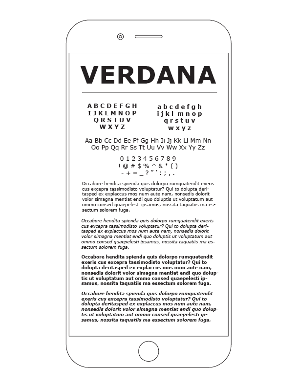
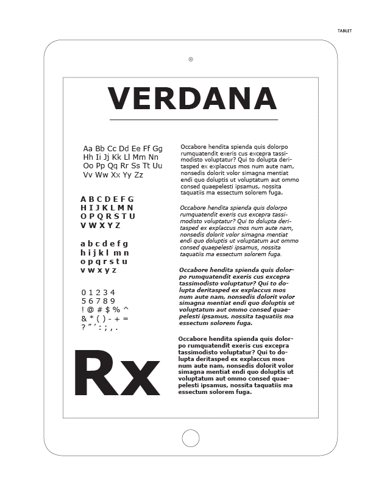
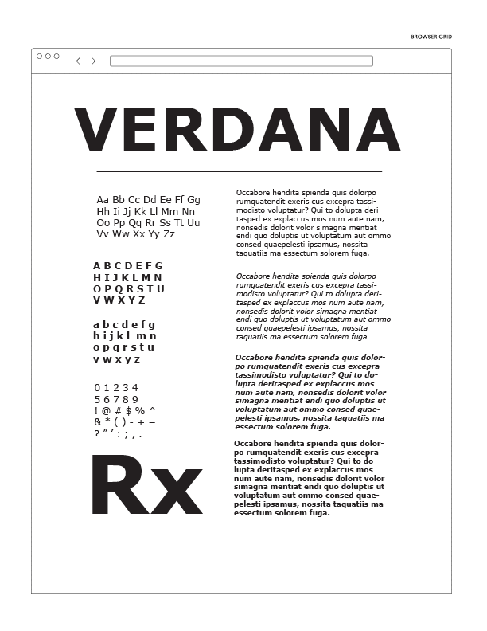

# Haiku 
- Mobile first design;

Adapt, Respond, Overcome,

errors of the past.

- Re-design the web.

Adapt, Respond, Overcome,

errors of the past.

- The new web design.

A flexible foundation,

become responsive.

- Lose concrete layout, (design)(structure)

respond to all devices.

Anew way forward.

#Text specimen concepts

